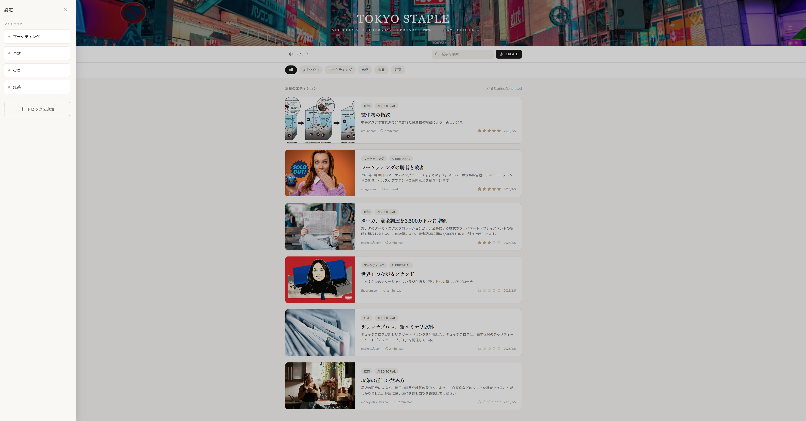
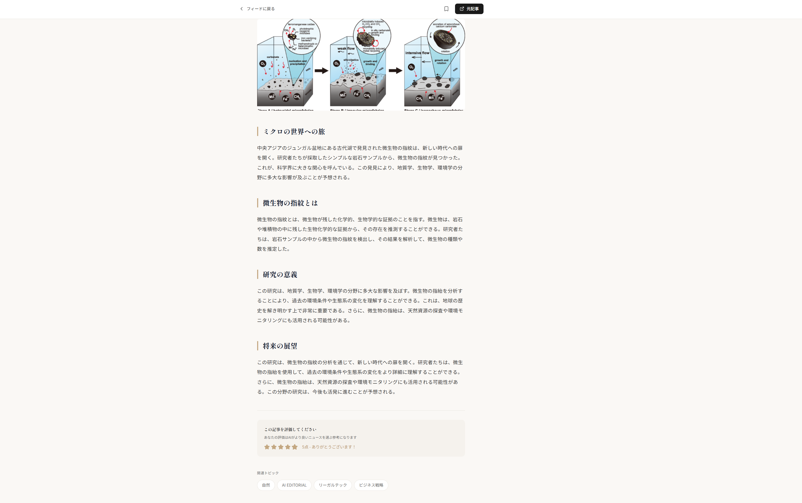
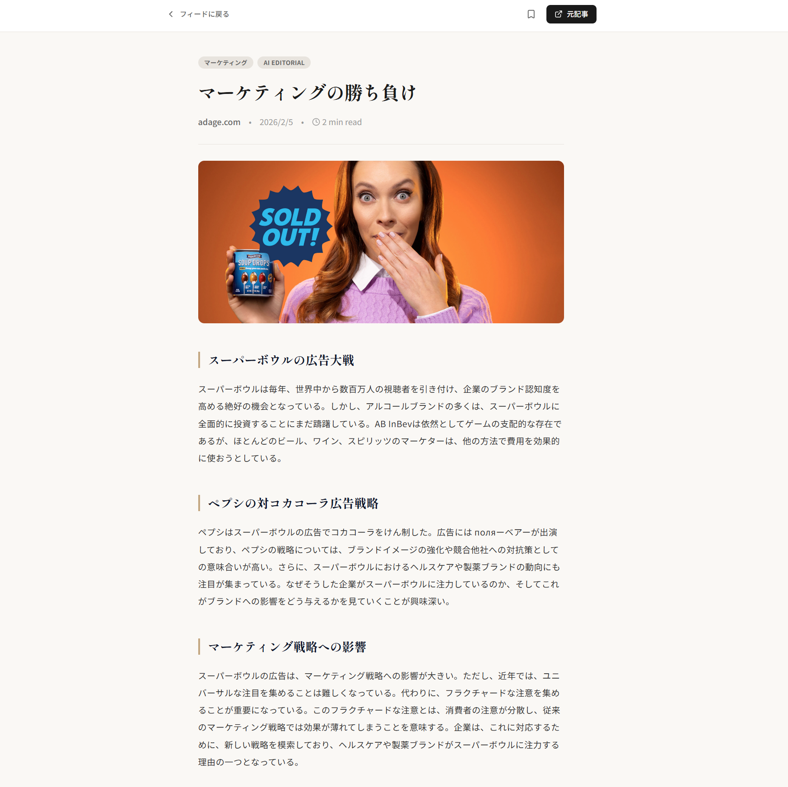
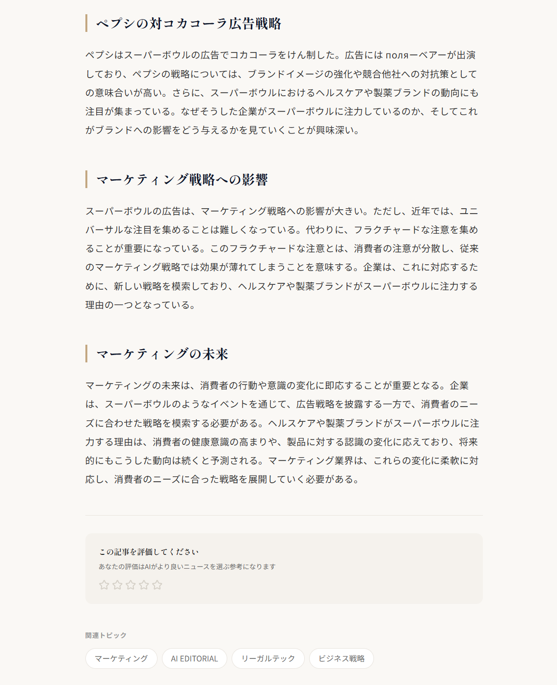

# TOKYO STAPLE

### "自分の専属記者" が世界中のニュースを再編集して届けるAIニュースアプリ。


## Overview
TOKYO STAPLE は、ユーザーの好みを学習し、単なるリンク集ではなく「読み応えのある雑誌記事」としてニュースを再生成するアプリケーションです。

通常のニュースアプリと異なり、AI（Llama 3.3）が収集した断片的な情報を元に、「背景・詳細・影響」を含む1000文字以上の長文記事をリアルタイムで執筆します。また、ユーザーの評価を学習し、使えば使うほど自分好みのトピックや切り口に進化していく「成長するニュースフィード」を実現しました。(後述の5段階評価)

## 本アプリを開発しようと思った背景

### 「情報過多」というマイクロストレスからの解放

既存のニュースアプリやメディアは情報の網羅性に優れていますが、一人のユーザーとして利用する中で、**情報過多** という課題を感じていました。
日々のニュース閲覧には、無意識のうちに以下の2つのステップが存在し、これが日課として人生に組み込まれることで大きなストレスに成りえるのではと分析しました。

1.  **Step 1（探索）:** 興味のない情報も混在するトップページから、自分の関心事を探し出す。
2.  **Step 2（選別）:** タイトルやサムネイルから、それが本当に読む価値のある記事かを見極める。

TOKYO STAPLE は、この **「Step 1（探索）」を完全にシステム側へオフロードする** ことを目的に開発されました。
アプリを立ち上げれば、そこには既に「フィルタリング済みの興味ある情報」だけが並んでいる——この体験こそが、現代のニュースアプリに必要だと考えました。

### 設計における2つのこだわり

**1. 「読む気力」を奪わないUX設計**
興味のあるトピックであっても、無限に記事が出てくるとユーザーは疲弊してしまいます。あえて**1回の生成における記事数に上限**を設けることで、消化不良を起こさせず、日課として心地よく使い続けられるボリューム感を意識しました。

**2. 生成AIによる「1〜3分で読める」独自記事化**
元記事をそのまま表示するのではなく、LLMによって再構成することで、以下のメリットを創出しています。

* **コンテキストと権利の管理:** 元記事の長文をそのまま引用することによる著作権リスクや、コンテキストあふれを回避します。
* **タイムパフォーマンス:** どんな複雑なニュースも「1分〜3分で読み切れる尺」に要約・執筆し直すことで、ユーザーが身構えることなく流し読みできる「軽やかな読書体験」を提供します。

## Key Features

### 1. AI Editorial Engine
* LLM (Llama 3.3 70B) を活用し、断片的なウェブニュースを「洞察に富んだ長文記事」にリライト。
* 既存のニュース要約にありがちな「短すぎる・無機質」な問題を解決するため、プロンプトエンジニアリングにより「雑誌のような文体と構成（HTML構造）」を強制。
* 記事タイトルも、スマホで読みやすい35文字以内のキャッチーな見出しに自動修正(後々スマホアプリとしての開発を想定)。

### 2. Smart Personalization
* ユーザーが記事に対して行った「5段階評価」をバックエンドで蓄積。
* 次回のニュース生成時に、高評価のタグをAIのコンテキスト（短期記憶）に注入することで、検索キーワードと解説の切り口を動的に変化させます。
* 例: 「SpaceX」の記事に高評価 → 次回から宇宙関連のニュースが増え、技術的な解説が深くなる。

<table border="0">
  <tr>
    <td width="50%" align="center">
      
      <br>
      <b>トピック管理画面</b><br>
      興味のあるジャンルを自由に追加・削除
    </td>
    <td width="50%" align="center">
      
      <br>
      <b>5段階評価システム</b><br>
      読了後に評価することで次回以降の生成精度が向上
    </td>
  </tr>
</table>

### 3. Intelligent Search Aggregator
* Tavily API (AI特化検索) と DuckDuckGo を併用したハイブリッド検索システム。
* Semantic De-duplication: difflib を用いた類似度判定により、異なるメディアが報じた同じ内容のニュース（例: "SpaceX買収"）が重複して表示されるのを防ぎ、フィードの多様性を確保。

### 4. High-Fidelity UI
* 「読む体験」を最優先し、紙媒体のような明朝体（Shippori Mincho）と可読性の高いゴシック体を使い分け。
* React + Tailwind CSS (Typography) により、美しくフォーマットされた記事レイアウトを実現。

<p align="center">
  
  
</p>
<p align="center">生成された記事のサンプル：明朝体とゴシック体を使い分けた雑誌風レイアウト</p>

---

## Tech Stack

| Category | Technology |
| --- | --- |
| **Frontend** | React (Vite), Tailwind CSS, Lucide React |
| **Backend** | Python, FastAPI, Uvicorn |
| **AI Model** | Groq (Llama-3.3-70b-versatile) |
| **Search** | Tavily API, DuckDuckGo Search (Fallback) |
| **Data** | JSON (User Preferences Storage) |

---

## Directory Structure

本リポジトリは、主要なコードのみを抽出した構成となっています。

```text
Tokyo_Staple/
│
├── backend/                   # Python側のコード
│   ├── main.py                # サーバー本体
│   ├── news_brain.py          # AIロジック
│   ├── search_agent.py        # 検索ロジック
│   └── requirements.txt       # 必要なライブラリ一覧
│
├── frontend/                  # React側のコード
│   ├── src/
│   │   ├── components/        # コンポーネント分割用フォルダ
│   │   │   ├── Header.jsx     # トップ画像、検索バー、トピックフィルターを含むヘッダー領域
│   │   │   ├── NewsCard.jsx   # ニュース表示用
│   │   │   └── Sidebar.jsx    # 設定（トピック管理）用のサイドメニュー
│   │   ├── App.jsx            # メイン画面とロジック
│   │   ├── main.jsx           # エントリーポイント
│   │   └── index.css          # TailwindなどのCSS設定
│   ├── index.html             # フォント読み込みタグがあるファイル
│   ├── tailwind.config.js     # デザイン設定
│   ├── postcss.config.js      # PostCSS設定
│   ├── vite.config.js         # ビルド設定
│   └── package.json           # ライブラリ情報の定義書
│
├── screenshots/               # デモ画像置き場
│   ├── demo_top.jpg           # トップページの画像
│   ├── demo_article_1.jpg     # 記事詳細の画像(1/2)
│   ├── demo_article_1-2.jpg   # 記事詳細の画像(2/2)
│   ├── demo_stars.jpg         # 記事の星5段階の評価画面
│   └── demo_setting.jpg       # トピック編集画面
│
└── README.md                  # プロジェクトの説明書
```

---

## Technical Highlights

### 1. 検索と生成の分離設計
「検索（Fact）」と「生成（Opinion）」のプロセスを明確に分離しました。
search_agent.py が事実情報を収集し、news_brain.py がそれを解釈・執筆するというパイプラインを構築することで、ハルシネーション（嘘の生成）を抑制しつつ、読み物としての面白さを追求しています。

### 2. 動的プロンプトインジェクション
ユーザーのフィードバック（星5段階による記事の評価）をLLMへのシステムプロンプトに直接埋め込む設計にしました。
これにより、「単にその単語を含む記事を探す」だけでなく、「ユーザーが好む視点（例：ビジネス戦略寄り、技術詳細寄り）」で記事を執筆させることを可能にしました。

### 3. フォールバック戦略
外部API（Tavily）や画像リンク切れなどの「外部要因によるエラー」を前提とした設計を行いました。
* Tavilyがダウンした場合は即座にDuckDuckGoに切り替え。
* 画像が取得できない、またはブロックされた場合は、自動的にUnsplashの高品質なプレースホルダー画像に差し替え。
* これにより、デモ環境での安定性を高めています。

---

## Prerequisites & Setup
動作には以下のAPIキーが必要です。
ルートディレクトリに `.env` ファイルを作成し、各キーを設定してください。

**Required API Keys:**
1. **Groq API Key:** LLM推論用 ([Get Key](https://console.groq.com/keys))
2. **Tavily API Key:** AI検索用 ([Get Key](https://tavily.com/))

**backend/.env**
```
GROQ_API_KEY=gsk_xxxxxxxxxxxxxx
TAVILY_API_KEY=tvly-xxxxxxxxxxxxxx
# 必要であれば
# OPENAI_API_KEY=sk-xxxxxxxx (for fallback or future features)

## How to Run

### Backend (Python)
```bash
cd backend
pip install -r requirements.txt
python main.py
```
APIサーバーが http://127.0.0.1:8000 で起動します。

### Frontend (React)
```bash
cd frontend
npm install
npm run dev
```
ブラウザで http://localhost:5173 にアクセスしてください。

---

## 今後の展望

商用利用を鑑みた場合、以下の機能拡張と最適化が考えられます。

### 1. コストとパフォーマンスの最適化
LLMおよび検索APIの従量課金コストを削減し、レスポンス速度を向上させるためにキャッシュ層を導入します。
* **Redis Implementation**: 同一トピックや類似の検索クエリに対しては、生成済みの記事をRedis等のインメモリDBにキャッシュし、APIリクエスト回数を抑制します。
* **TTL Strategy**: ニュースの鮮度を保つため、キャッシュの有効期限（TTL）を適切に設定し、「コスト削減」と「情報の即時性」のバランスを最適化します。

### 2. サービス品質の向上
現在はプロトタイプとして無料枠や軽量モデルを使用していますが、実運用環境では有償サービスの導入により品質を担保します。
* **Advanced Models**: GPT-4o や Claude 3.5 Sonnet などの商用APIを採用し、より複雑な文脈理解と自然な日本語生成、ハルシネーションの低減を実現します。
* **Premium Search**: Google Custom Search API (Paid) などを導入し、検索ソースの信頼性と網羅性を向上させ、マイナーなトピックへの対応力を強化します。

---

## Note
このプロジェクトはデモアプリケーションです。APIキー等は環境変数またはコード内で適切に設定する必要があります。